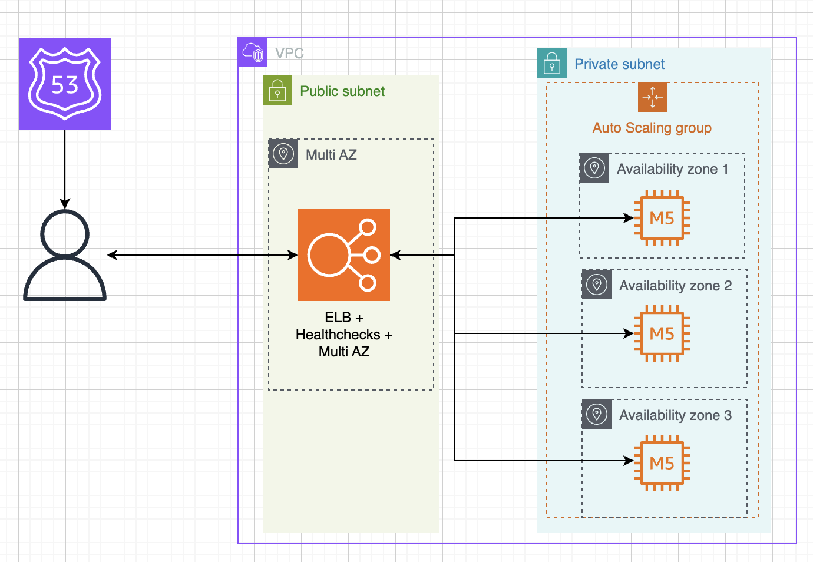

# Multi-AZ Load Balancer Infrastructure

A robust, scalable AWS infrastructure project demonstrating multi-availability zone deployment with Application Load Balancer, Auto Scaling, and Route 53 integration using Terraform.

## 🎯 Project Overview

This project showcases enterprise-grade AWS infrastructure automation using Infrastructure as Code (IaC) principles. It deploys a highly available web application across multiple availability zones with automatic scaling capabilities and load balancing.

### Key Features

- **High Availability**: Deployed across 3 availability zones (us-east-1a, us-east-1b, us-east-1c)
- **Auto Scaling**: Automatically scales based on CPU utilization (target: 50%)
- **Load Balancing**: Application Load Balancer distributes traffic across healthy instances
- **Custom Domain**: Route 53 integration for custom domain mapping
- **Security**: Proper security groups with minimal required access
- **Monitoring**: Health checks and target tracking for optimal performance

## 🏗️ Architecture



## 🛠️ Technology Stack

- **Infrastructure as Code**: Terraform
- **Cloud Provider**: AWS
- **Compute**: EC2 instances (Amazon Linux 2023)
- **Load Balancing**: Application Load Balancer (ALB)
- **Auto Scaling**: Auto Scaling Groups with target tracking
- **Networking**: VPC with public/private subnets across 3 AZs
- **DNS**: Route 53 for domain management
- **Web Server**: Python HTTP server serving static content

## 📁 Project Structure

```
.
├── .github/
│   └── workflows/
│       ├── deploy-infra.yml      # GitHub Actions deployment workflow
│       └── destroy-infra.yml     # GitHub Actions destruction workflow
├── application-load-balancer.tf  # ALB configuration and target groups
├── auto-scaling-group.tf         # ASG, launch template, and scaling policies
├── backend.tf                    # Terraform backend configuration
├── hosted-record.tf              # Route 53 DNS records
├── locals.tf                     # Local variables and common tags
├── outputs.tf                    # Output values
├── security-groups.tf            # Security group definitions
├── variables.tf                  # Input variables
├── vpc.tf                        # VPC and subnet configuration
├── user_data.sh                  # EC2 instance initialization script
├── stress-instance.sh            # CPU stress testing utility
└── README.md                     # Project documentation
```

## 🚀 Deployment Guide

### Prerequisites

1. **AWS CLI configured** with appropriate credentials
2. **Terraform installed** (version 1.7.0+)
3. **Domain registered** in Route 53 (or hosted zone available)
4. **GitHub repository** with proper secrets and variables configured (for CI/CD deployment)

### Deployment Options

#### Option 1: Manual Deployment

1. **Clone the repository**
   ```bash
   git clone <repository-url>
   cd multi-az-load-balancer
   ```

2. **Initialize Terraform**
   ```bash
   terraform init
   ```

3. **Configure variables**
   Create a `terraform.tfvars` file:
   ```hcl
   hosted_zone_id = "Z1D633PJN98FT9"  # Your Route 53 hosted zone ID
   record_name    = "app.yourdomain.com"  # Your desired FQDN
   ```

4. **Plan and apply**
   ```bash
   terraform plan
   terraform apply
   ```

5. **Access your application**
   After deployment, access your application using the provided ALB DNS name or your custom domain.

#### Option 2: GitHub Actions CI/CD Deployment

This project includes automated deployment workflows using GitHub Actions for streamlined DevOps practices.

##### Setup GitHub Secrets and Variables

**Repository Secrets:**
```
AWS_ROLE_TO_ASSUME = arn:aws:iam::ACCOUNT-ID:role/GitHubActionsRole
HOSTED_ZONE_ID = Z1D633PJN98FT9
```

**Repository Variables:**
```
AWS_REGION = us-east-1
STATE_BUCKET = your-terraform-state-bucket
RECORD_NAME = app.yourdomain.com
```

##### Available Workflows

**Deploy Infrastructure (`deploy-infra.yml`)**
- **Trigger**: Manual workflow dispatch
- **Purpose**: Deploy the complete infrastructure
- **Features**: 
  - Terraform formatting validation
  - Infrastructure validation
  - Plan generation
  - Automated deployment
  - Uses OpenID Connect (OIDC) for secure AWS authentication

**Destroy Infrastructure (`destroy-infra.yml`)**
- **Trigger**: Manual workflow dispatch
- **Purpose**: Safely destroy all deployed resources
- **Features**:
  - Validation checks before destruction
  - Complete resource cleanup
  - Cost optimization

##### Running the Workflows

1. **Deploy Infrastructure**:
   - Go to **Actions** tab in your GitHub repository
   - Select **Deploy Infrastructure** workflow
   - Click **Run workflow**
   - Monitor the deployment progress

2. **Destroy Infrastructure**:
   - Go to **Actions** tab in your GitHub repository  
   - Select **Destroy Infrastructure** workflow
   - Click **Run workflow**
   - Confirm resource destruction

##### CI/CD Benefits

- **Automated Deployment**: No need for local Terraform setup
- **Consistent Environment**: Same deployment process across all environments
- **Security**: Uses AWS IAM roles with temporary credentials
- **Audit Trail**: Complete deployment history and logs
- **Collaboration**: Team members can deploy without local AWS credentials

## 🔧 Configuration Details

### Auto Scaling Configuration
- **Desired Capacity**: 2 instances
- **Minimum**: 1 instance
- **Maximum**: 3 instances
- **Scaling Trigger**: CPU utilization ≥ 50%

### Network Configuration
- **VPC CIDR**: 10.0.0.0/16
- **Public Subnets**: 10.0.101.0/24, 10.0.102.0/24, 10.0.103.0/24
- **Private Subnets**: 10.0.1.0/24, 10.0.2.0/24, 10.0.3.0/24

### Security Groups
- **ALB Security Group**: Allows HTTP (port 80) from internet
- **ASG Security Group**: Allows HTTP (port 80) from ALB only

## 🧪 Testing

### Load Testing
Use the included stress testing script to simulate high CPU usage:

```bash
# SSH into an EC2 instance and run:
chmod +x stress-instance.sh
./stress-instance.sh
```

This will trigger the auto scaling policy and demonstrate horizontal scaling.

### Health Checks
The ALB performs health checks every 15 seconds on the root path ("/") with the following configuration:
- **Healthy threshold**: 2 consecutive successful checks
- **Unhealthy threshold**: 3 consecutive failed checks
- **Timeout**: 5 seconds

## 📊 Monitoring and Outputs

After deployment, you'll receive:
- **ALB DNS Name**: Public endpoint for your application
- **Route 53 Record**: Custom domain pointing to the ALB

Each EC2 instance serves a simple webpage displaying:
- Confirmation message ("It works! ✨")
- Instance ID for load balancing verification

## 🔄 DevOps Best Practices Demonstrated

1. **Infrastructure as Code**: Complete infrastructure defined in version-controlled Terraform files
2. **High Availability**: Multi-AZ deployment ensuring resilience
3. **Auto Scaling**: Responsive to demand changes
4. **Security**: Least privilege access with proper security groups
5. **Modularity**: Clean separation of concerns across multiple files
6. **Documentation**: Comprehensive project documentation
7. **Testing**: Included tools for testing auto-scaling behavior
8. **CI/CD Integration**: Automated deployment pipelines with GitHub Actions
9. **GitOps**: Infrastructure changes managed through Git workflows

## 🚦 CI/CD Pipeline Features

### GitHub Actions Workflows

**Deploy Infrastructure Workflow (`deploy-infra.yml`)**
- **Authentication**: Uses AWS IAM roles with OpenID Connect (OIDC) for secure, temporary credentials
- **Validation**: Terraform format checking and configuration validation
- **Planning**: Generates and reviews execution plans before deployment
- **State Management**: Remote state storage in S3 with proper backend configuration
- **Error Handling**: Graceful handling of deployment failures
- **Manual Trigger**: Workflow dispatch for controlled deployments

**Destroy Infrastructure Workflow (`destroy-infra.yml`)**
- **Safety Checks**: Validation before resource destruction
- **Complete Cleanup**: Removes all deployed AWS resources
- **Cost Control**: Prevents unnecessary cloud spending
- **Manual Trigger**: Prevents accidental infrastructure destruction

### Security & Best Practices
- **No Long-lived Credentials**: Uses temporary AWS credentials via OIDC
- **Least Privilege**: IAM roles with minimal required permissions
- **Secret Management**: Sensitive data stored in GitHub Secrets
- **Audit Trail**: Complete deployment history in GitHub Actions logs
- **Environment Isolation**: Separate workflows for different environments

## 🧹 Cleanup

### Manual Cleanup
To destroy the infrastructure and avoid charges:

```bash
terraform destroy
```

### CI/CD Cleanup
Use the **Destroy Infrastructure** GitHub Actions workflow:
1. Navigate to **Actions** → **Destroy Infrastructure**
2. Click **Run workflow**
3. Monitor the destruction process in the workflow logs

## 📝 Variables Reference

| Variable | Description | Type | Required |
|----------|-------------|------|----------|
| `hosted_zone_id` | Route 53 hosted zone ID for your domain | string | Yes |
| `record_name` | FQDN to publish as an ALIAS (e.g., app.example.com) | string | Yes |

## 🎓 Learning Outcomes

This project demonstrates proficiency in:

### Infrastructure & Cloud Services
- AWS core services (EC2, ALB, ASG, VPC, Route 53)
- Terraform infrastructure automation and state management
- High availability architecture design across multiple AZs
- Auto scaling and load balancing concepts
- Security best practices with least privilege access

### DevOps & CI/CD Practices
- **GitHub Actions Workflows**: Automated infrastructure deployment pipelines
- **Infrastructure as Code (IaC)**: Version-controlled infrastructure definitions
- **GitOps**: Git-based workflow for infrastructure changes
- **Security**: OIDC integration for secure cloud authentication without long-lived credentials
- **Pipeline Design**: Multi-stage deployment with validation, planning, and execution phases
- **Environment Management**: Consistent deployment across different environments
- **Monitoring & Validation**: Automated health checks and deployment verification
- **Rollback Strategies**: Safe infrastructure destruction and cleanup procedures

### Advanced DevOps Concepts
- **State Management**: Remote Terraform state with S3 backend
- **Secret Management**: Secure handling of sensitive configuration via GitHub Secrets
- **Automation**: Fully automated deployment without manual intervention
- **Audit & Compliance**: Complete deployment history and change tracking
- **Cost Optimization**: Automated resource cleanup to prevent unnecessary charges

---

**Author**: Fredy Lemus  
**Project Type**: DevOps Infrastructure Automation  
**Technology Focus**: AWS, Terraform, Infrastructure as Code
